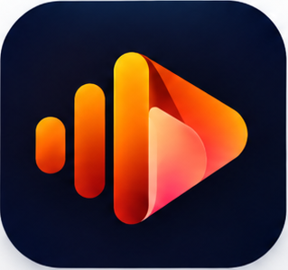
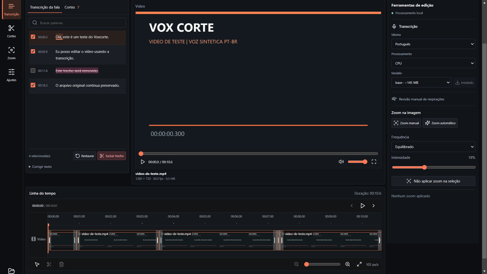

<p align="center">
  
</p>

<h1 align="center">Vox Corte</h1>
<p align="center"><strong>Edite pela fala. Dê ritmo ao seu vídeo.</strong></p>
<p align="center">Um editor local para Windows, feito para transformar o tempo dos cortes em tempo para criar.</p>

<p align="center">
  <a href="https://ygorcaparelli.github.io/vox-corte/">Site e demonstração</a> ·
  <a href="https://github.com/ygorcaparelli/vox-corte/releases/latest">Baixar para Windows</a> ·
  <a href="https://github.com/ygorcaparelli/vox-corte/issues">Reportar um problema</a>
</p>
<p align="center">Windows 10/11 x64 · Português do Brasil · Processamento local · Versão 1.12.2</p>

[](https://ygorcaparelli.github.io/vox-corte/#demonstracao)

## Por Que Criei

Comecei a criar conteúdo e percebi quanto tempo levava para organizar os cortes
e dar dinâmica ao vídeo com zoom. Procurei ferramentas para algo que parecia
simples, mas muitas exigiam uma assinatura. Eu não queria pagar R$ 400 por ano
para resolver essa parte do meu processo.

O Vox Corte nasceu dessa necessidade: um aplicativo que me ajudasse a editar
pela fala, cortar pausas e aplicar zoom, com processamento no próprio computador.
O projeto foi desenvolvido com assistência de IA, testes automatizados e
verificação do fluxo real. Continua em desenvolvimento.

## O Que Ele Faz

| Recurso | Na prática |
| --- | --- |
| Edição por transcrição | Excluir palavras ou frases remove o áudio **e o vídeo** correspondentes. Não é só legenda. |
| Transcrição local | faster-whisper com timestamps por palavra, idioma selecionável e detecção automática. |
| Cortes de pausas | Detecção de silêncios e possíveis respirações, com escuta e revisão dos intervalos. |
| Linha do tempo | Miniaturas de vídeo, áudio vinculado, seleção e ajuste das bordas dos cortes. |
| Zoom | Enquadramento manual ou padrões automáticos de aproximação e afastamento. |
| Projetos | Biblioteca local, salvamento automático e arquivos de projeto reutilizáveis. |
| Edição reversível | Restaurar trechos, desfazer e refazer sem modificar o arquivo original. |
| Exportação | MP4 com os cortes e zooms aplicados, escolhendo pasta e nome do arquivo. |

**Corrigir texto** altera a transcrição. **Excluir trecho** altera a montagem.
São operações diferentes e o aplicativo mantém essa distinção.

## Baixar e Instalar

**[Baixar o instalador 1.12.2 para Windows](https://github.com/ygorcaparelli/vox-corte/releases/download/v1.12.2/Vox-Corte-Instalar-1.12.2.exe)**

1. Baixe o instalador na página de [versões oficiais deste repositório](https://github.com/ygorcaparelli/vox-corte/releases).
2. Salve o projeto e feche o Vox Corte antes de instalar ou atualizar.
3. Execute o instalador. Ele inclui os runtimes; não exige Node.js ou Python instalados à parte.
4. No primeiro uso da transcrição, escolha e baixe um modelo no próprio aplicativo.

Windows 10 ou 11, 64 bits. Download: **249,7 MiB**. Reserve espaço adicional para
instalação, modelos, cache e exportações. CPU disponível; NVIDIA depende de
hardware e bibliotecas compatíveis.

> O instalador ainda não possui certificado digital. O Windows pode mostrar um
> aviso de editor desconhecido. Confira a origem e o [SHA-256](docs/downloads/SHA256SUMS.txt)
> antes de executar. Não desative as proteções do Windows.

```powershell
Get-FileHash -Algorithm SHA256 .\Vox-Corte-Instalar-1.12.2.exe
```

Hash esperado:
`d0616370f81712c499cd18b006d1565164d300f24629db830c844766f13f6c6d`

## Do Vídeo ao MP4

1. Crie um projeto e importe um vídeo.
2. Transcreva a fala no idioma desejado.
3. Selecione palavras ou frases e exclua os trechos que não quer manter.
4. Revise as pausas, ajuste as bordas e aplique zoom onde fizer sentido.
5. Confira a prévia e exporte o MP4 para a pasta escolhida.

O vídeo original é preservado. Projetos guardam decisões de edição, não uma
cópia completa do vídeo. Mantenha a mídia no caminho original para reabrir o projeto.
Após baixar o modelo, o fluxo principal pode funcionar offline, sem API paga ou
envio do vídeo a servidores para processamento.

## Demonstração e Testes

**[Assistir à demonstração](https://ygorcaparelli.github.io/vox-corte/#demonstracao)** ·
**[Ler o relatório de testes](docs/demo/testes.md)**

Na execução documentada da versão 1.12.2: 76 testes automatizados aprovados,
200 comparações com os cortes da versão 1.10.2 e 10 verificações funcionais.
O MP4 de teste foi transcrito novamente para conferir a remoção da frase escolhida;
o original teve sua integridade verificada por SHA-256.

As capturas são do aplicativo real. O vídeo de teste e a narração da demonstração
são sintéticos. Esses resultados não garantem compatibilidade com todos os vídeos.

## Limitações Atuais

- Reconhecimento de fala e detecção de pausas exigem revisão humana. A detecção de respiração é heurística.
- Zoom automático usa padrões de enquadramento; não rastreia rostos.
- A linha do tempo mantém vídeo e áudio vinculados; não é um editor multifaixa completo.
- O desempenho da prévia e da exportação depende de codecs, resolução, duração e hardware.
- A instalação atual usa um pacote local .NET/PowerShell, sem certificado digital nem assistente NSIS.
- O código está público, mas este repositório ainda não define uma licença de reutilização.

## Desenvolvimento

| Camada | Tecnologia |
| --- | --- |
| Aplicativo Windows | Electron |
| Interface | React, TypeScript e Vite |
| Serviço local | Python e FastAPI |
| Transcrição | faster-whisper |
| Processamento de mídia | FFmpeg |
| Prévia | Mediabunny, WebCodecs e Web Audio |
| Site de download | HTML, CSS e JavaScript, sem framework ou rastreadores |

Requisitos de desenvolvimento: Windows x64, Python 3.11/3.12 e Node.js LTS.

```powershell
py -3.12 -m venv .venv
.\.venv\Scripts\python.exe -m pip install -r backend\requirements.txt
npm install
npm run build
npm start
```

```powershell
npm test
.\.venv\Scripts\python.exe -m unittest discover -s backend -p "test_*.py"
```

O Electron inicia o serviço local. Para instruções de execução no navegador,
empacotamento e detalhes das versões anteriores, consulte
[Desenvolvimento e Histórico](docs/DESENVOLVIMENTO.md).

```text
src/          Interface e lógica de edição
electron/     Janela desktop e integração com o Windows
backend/      Transcrição, análise e exportação locais
scripts/      Empacotamento, demonstrações e testes funcionais
assets/       Identidade do aplicativo e instalador
docs/         Site, documentação e evidências de testes
```

O site está em `docs/`. Veja [como publicar e atualizar](docs/PUBLICACAO.md).
Vídeos pessoais, modelos, caches, ambientes locais e instaladores não entram no Git.

---

Feito por [Ygor Caparelli](https://github.com/ygorcaparelli), a partir de uma
necessidade real de quem começou a criar conteúdo.
