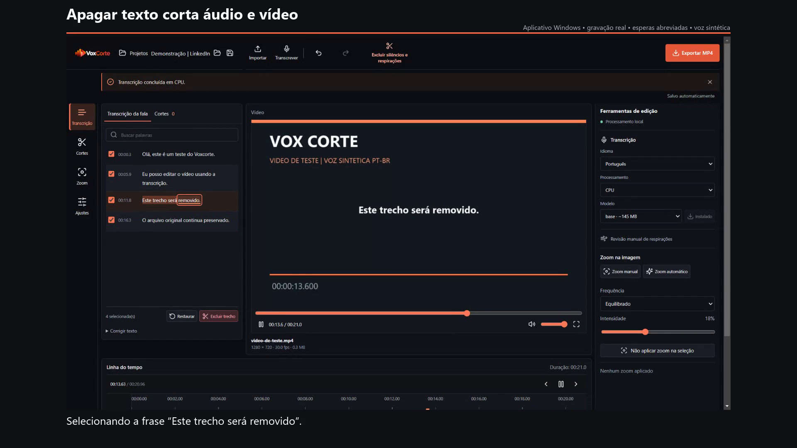

# Vox Corte: Desenvolvimento e Histórico

Este documento preserva o histórico técnico. Para baixar a versão atual e ver as
instruções principais, consulte o [README](../README.md). Caminhos em `outputs/`
indicam artefatos locais de desenvolvimento, não downloads públicos.

**Comecei a criar conteudo. Acabei criando meu proprio editor.**

O projeto nasceu de uma necessidade real: reduzir o tempo organizando cortes e
criando dinamica com zoom, sem depender de mais uma assinatura de edicao.
Desenvolvido com assistencia de IA, testes automatizados e verificacao do fluxo real.



## O Que Faz

- Apagar uma frase na transcricao remove seu audio e video na exportacao.
- Projetos locais salvos, cortes reversiveis, desfazer e refazer.
- Deteccao de pausas com revisao manual dos trechos removidos.
- Linha do tempo com miniaturas, zoom manual e automatico na imagem.
- Exportacao MP4 com escolha de pasta, preservando o arquivo original.
- Transcricao local via faster-whisper; apos baixar o modelo, o fluxo funciona offline.

Na demonstracao da versao 1.12.2: **76 testes automatizados aprovados**, 200
comparacoes com o corte da versao 1.10.2 e 10 verificacoes funcionais.
Confira o [relatorio](demo/testes.md) e a captura do editor acima.
A midia e a narracao da demonstracao sao sinteticas; a gravacao do aplicativo e real.

**Em desenvolvimento:** cortes automaticos exigem revisao. O zoom nao rastreia
rostos, a linha do tempo nao e multifaixa e o desempenho depende do arquivo e hardware.
Os instaladores locais citados no historico abaixo nao sao releases publicas.

## Desenvolvimento Rapido

Requisitos: Windows x64, Python 3.11/3.12 e Node.js LTS.

```powershell
py -3.12 -m venv .venv
.\.venv\Scripts\python.exe -m pip install -r backend\requirements.txt
npm install
npm run build
npm start
```

```powershell
npm test
.\.venv\Scripts\python.exe -m unittest discover -s backend -p "test_*.py"
```

As secoes seguintes incluem instrucoes detalhadas e o historico de desenvolvimento.

Editor desktop para Windows 10/11, com interface em português e processamento local. Importa vídeo, gera palavras com timestamps via faster-whisper, permite excluir trechos e exporta MP4 com cortes reais de áudio e vídeo. O arquivo original é preservado.

## Instalação e execução

### Biblioteca de projetos (codigo atual)

A tela inicial organiza projetos locais: criar, buscar, abrir, renomear e excluir.
Cada projeto tem um identificador independente, inclusive quando varios usam o mesmo video.
As edicoes aplicadas sao salvas automaticamente em `.local/projects` no navegador
ou na pasta de dados do aplicativo instalado. O botao Projetos salva antes de voltar
a biblioteca. Projetos vazios tambem ficam salvos. Excluir remove somente o JSON do
projeto, nunca a midia original nem as exportacoes. Mantenha o video no caminho original.
Arquivos `.falacorte.json` anteriores podem ser abertos como um novo projeto;
a ultima recuperacao da versao anterior tambem pode ser importada pela tela inicial.
O instalador 1.12.2 inclui esta biblioteca no aplicativo Windows.

### Versao atual 1.12.2

O instalador atual e `outputs/release/Vox Corte Instalar 1.12.2.exe`. Salve o projeto e feche o Vox Corte antes de atualizar. A identidade, os modelos e os dados existentes sao preservados. Inclui biblioteca de projetos e restaura somente o corte automatico original da 1.10.2.

Na 1.12.2, o detector voltou ao limiar VAD 0,5, fala minima de 60 ms, pausas de 80 ms e janelas de 30 segundos sem sobreposicao. O corte nao acrescenta margens de fala/palavras e remove intervalos a partir de 80 ms, como na 1.10.2. O layout e os projetos continuam atuais. Revisar cortes automaticos substitui os anteriores identificados por `automatic` ou pelo rotulo legado `Corte seco entre falas`, inclusive quando a nova analise nao encontra cortes. Preserva cortes manuais e permite desfazer a revisao inteira. Atualizar sozinho nao modifica os projetos: reanalise para aplicar o comportamento antigo. `scripts/verify_legacy_cuts.py` compara os parametros e 200 conjuntos de intervalos com o pacote arquivado 1.10.2.

- Exportacao: o filtro de enquadramento agora e ignorado nos quadros sem zoom, sem reduzir resolucao, FPS ou qualidade de codificacao. A previa pausa automaticamente e seus controles ficam bloqueados durante a exportacao. O tempo restante e aproximado, calculado pela velocidade real e pela duracao editada; a finalizacao do MP4 pode acrescentar tempo.
- Recuperacao: alteracoes aplicadas sao salvas automaticamente, com cache local imediato e gravacao atomica no servico local. Ao reabrir, Recuperar projeto restaura o ultimo projeto, incluindo zooms e preferencias. Em `.local/recovery` (ou na pasta de dados do app instalado) ficam apenas JSONs de edicao, por caminho, mais o ultimo projeto e uma copia anterior para recuperar arquivo corrompido. Nao sao copiados videos. O arquivo fonte precisa continuar no caminho original. Ajustes de zoom ainda nao aplicados e o historico de desfazer nao sao recuperados.
- Revisao de cortes: Ouvir continua reproduzindo apenas o trecho removido. Os icones de fone e salto permitem ouvir o original com 0,8 segundo de contexto de cada lado e comparar com o corte aplicado, pulando tambem outros cortes dentro desse contexto. Os limites continuam ajustaveis e restauraveis.
- Corte automatico: restaurado ao comportamento original descrito acima; a protecao adicional introduzida nas versoes 1.11-1.12.1 nao e aplicada. Revise cortes antes de exportar, pois a deteccao nao e infalivel.
- Zoom automatico: frequencia Discreto/Equilibrado/Frequente e intensidade 5-40%. O botao aplica as preferencias, preservando efeitos manuais. Nao aplicar zoom na selecao protege o intervalo na fonte, remove automaticamente efeitos automaticos que o atravessam e persiste no projeto. Intervalos protegidos aparecem no tempo original, mesmo se forem cortados depois.
- Linha do tempo: ferramenta de selecao de intervalo (tambem Shift+arraste), faixa destacada, Delete/Backspace, limpar selecao, desfazer/refazer, arraste de bordas em quadros com rolagem lateral e tempo do ajuste. Miniaturas preservam a imagem inteira e nomes sao ocultados em clipes pequenos para reduzir ruido visual. Video e audio continuam vinculados em uma faixa.

Testes: `scripts/improvements_ui_test.cjs` verifica o fluxo real acima, recuperacao apos limpar o cache, MP4 exportado e layouts desktop/mobile. `scripts/export_zoom_benchmark.py` compara pixels com/sem bypass e mede filtros e exportacao completa usando somente fixtures sinteticas temporarias; o ganho nao e previsao para videos do usuario. `backend/test_recovery.py` cobre gravacao concorrente, arquivo corrompido, snapshots atrasados e projetos invalidos. Os testes anteriores de clipes, zoom, sincronizacao de audio e exportacoes com muitos efeitos continuam disponiveis.

### Ritmo automatico 1.10.2

O pacote atual e `outputs/release/Vox Corte Instalar 1.10.2.exe`. Zoom automatico agora distribui efeitos pela montagem, sem reiniciar o padrao a cada corte de fala. Alterna aproximacao seca com retorno lento (12 segundos), aproximacao lenta com retorno seco (14 segundos) e zoom seco fixo (5 segundos), com pausas de 20 a 26 segundos sem efeito. Videos curtos recebem intervalos menores ou nenhum efeito. Clique em Zoom automatico novamente para substituir o padrao anterior; zooms manuais sao preservados e Desfazer restaura o lote anterior.

### Correcao de estabilidade 1.10.1

Abra `outputs/release/Vox Corte Instalar 1.10.1.exe` no Explorador de Arquivos. Salve seu projeto e feche o editor antes de atualizar. O instalador e os atalhos usam as logos fornecidas pelo usuario. Exportar MP4 permite escolher pasta e nome do arquivo no navegador e no desktop; os dados existentes continuam na mesma pasta interna. As secoes seguintes registram as versoes anteriores.

Esta versao corrige a oscilacao do enquadramento durante aproximacoes e afastamentos: a exportacao usa coordenadas fracionarias, sem arredondar a janela de recorte para pixels inteiros. A previa anima o zoom no tempo do quadro exibido. Zooms automaticos entram e saem suavemente; zooms manuais mantem os valores escolhidos. Projetos salvos tambem recebem a correcao ao abrir, sem precisar recriar os efeitos.

`scripts/zoom_stability_test.py` mede o deslocamento de um alvo parado, verifica movimentos sem reversoes indesejadas e exporta MP4s com cortes, zoom automatico e audio continuo pelos dois caminhos de exportacao. `scripts/zoom_ui_test.cjs` confere a sincronizacao do zoom durante a reproducao, controles, desfazer/refazer, salvar/reabrir e MP4 real. Os testes usam arquivos pequenos, sem copiar videos do usuario.

### Enquadramento e logo 1.9.1

O pacote atual e `outputs/release/Fala Corte Instalar 1.9.1.exe`. A imagem agora fica num palco separado dos controles, com a proporcao real do arquivo e largura integral para paisagem quando cabe na altura disponivel. A altura do painel nao achata a imagem. Videos verticais preservam a proporcao, sem cortar as bordas; a altura e limitada pela janela. A regra antiga de 450 px do player em telas menores foi neutralizada, para nao esconder imagem ou controles. Tela cheia inclui o player e seus controles. Nenhum corte ou zoom do projeto foi alterado por essa mudanca de layout.

O cabecalho e o titulo mostram VoxCorte. Os nomes de instalacao, appId e pasta de dados continuam Fala Corte para preservar as atualizacoes e os modelos/projetos existentes. O bitmap `src/assets/voxcorte-wordmark.png` foi adaptado da referencia do usuario pelo image_gen integrado: fundo transparente, simbolo e Corte nas cores originais, Vox branco para contraste. O original foi preservado. Prompt utilizado: "Extract ONLY the top horizontal VoxCorte logo. Deliver a tightly framed wide horizontal transparent PNG ready for a dark charcoal desktop application header. Preserve faithfully the supplied symbol's shapes, overlapping ribbons, three rounded bars and orange/red/coral colors, and the exact spelling and heavy sans lettering VoxCorte. The ONLY color adaptation is change the dark Vox letters to solid white for legibility on a dark background; keep Corte in the supplied orange/coral tones. No background, no white rectangle, no palette, no icon tiles, no captions, no new branding. Keep a small even transparent margin around the wordmark."

`scripts/framing_test.cjs` verifica 16:9, 9:16 e 4:3 em desktop e celular, proporcao das caixas, pixels de borda, imagem/controles inteiros no player, ausencia de overflow, tela cheia e transparencia da logo. As fixtures pequenas sao geradas por `scripts/framing_fixture.py`.

### Interface Studio 1.9.0

O instalador desta etapa e `outputs/release/Fala Corte Instalar 1.9.0.exe`. A interface segue a referencia visual enviada: fundo neutro escuro com acentos coral, navegacao lateral, transcricao compacta a esquerda, monitor no centro, ferramentas a direita e linha do tempo embaixo. Nesta etapa mantinha a identidade Fala Corte, sem copiar recursos proprietarios ou mostrar controles sem implementacao.

A transcricao e dividida visualmente em linhas de ate 12 palavras ou 6 segundos, sem modificar palavras, IDs ou timestamps do projeto. Desmarcar Manter trecho corta realmente aquele intervalo; marcar restaura. Selecao de palavras por mouse/teclado e exclusao continuam disponiveis. A aba Cortes permite localizar, ouvir, ajustar e restaurar intervalos. Corrigir texto e selecao manual na fonte ficam recolhidos. Idioma, dispositivo, modelo, revisao de respiracoes e zoom ficam no painel direito. Video e audio continuam vinculados em uma unica faixa de miniaturas.

Os paineis se reorganizam em telas menores, sem overflow horizontal. Teste focal `scripts/studio_layout_test.cjs` verifica organizacao, rolagem da transcricao, checkbox com corte real, ouvir/restaurar, selecao por teclado, desfazer, zoom e capturas em 1536, 1100, 768 e 390 px. Testes existentes de zoom e clipes verificam a exportacao e recuperacao por arraste. A geracao do instalador segue o mesmo mecanismo x64 da versao 1.8.0 descrito abaixo; os instaladores antigos permanecem disponiveis, mas nao tem o novo layout.

Para instalar a versão atual, abra no Explorador de Arquivos `outputs/release/Fala Corte Instalar 1.9.1.exe` com dois cliques. O instalador em português instala em `%LOCALAPPDATA%\Programs\Fala Corte`, para o usuário atual, e cria atalhos na Área de Trabalho e no menu Iniciar. Inclui Python, FFmpeg e as dependências de transcrição: não exige Node ou Python instalados separadamente. O modelo de transcrição pode precisar ser baixado no primeiro uso. Salve seu projeto e feche o aplicativo antes de atualizar; depois abra o projeto salvo. O executável não é assinado. Instaladores e cópias antigas não incluem a logo e o enquadramento corrigido.

O instalador 1.8.0 usa um invólucro .NET x64 e PowerShell do Windows, pois o compilador NSIS falhou por realocação de DLL neste ambiente. Valida o SHA-256 do pacote antes da extração, preserva projetos/dados e oferece também `Fala-Corte-1.8.0-instalar.zip`: extraia tudo e execute `Instalar Fala Corte.cmd`. Não inclui o assistente NSIS nem registro novo na lista de aplicativos instalados do Windows. O EXE foi testado instalando e atualizando uma pasta isolada, sem criar atalhos reais nem iniciar o editor. A janela Electron não pôde ser validada pelo Playwright no ambiente restrito. A API, a exportação com zoom e a transcrição offline passaram usando o serviço e o runtime incluídos no pacote. `scripts/desktop_zoom_test.cjs` fica disponível para repetir o teste nativo num ambiente sem essa restrição.

Para reproduzir o pacote alternativo após compilar e empacotar `win-unpacked`, execute `.venv\Scripts\python.exe scripts\package_local_installer.py`. A opção `--reuse` reutiliza o ZIP de aplicação existente e deve ser usada apenas quando os arquivos de `win-unpacked` não mudaram.

## Linha do tempo de video (1.7.1)

### Previa web com faixa alinhada a esquerda

### Zoom na imagem

Na versao 1.8.0, no aplicativo e no navegador, o painel Zoom na imagem fica abaixo da linha do tempo. Zoom manual abre inicio/fim no tempo da montagem, escalas inicial/final de 100 a 300%, movimento fixo/aproximar/afastar, curva suave/linear e posicao horizontal/vertical. A previa responde aos ajustes sem renderizar outro video. Aplicar zoom confirma a edicao; cancelar descarta o ajuste. Desfazer/refazer e salvar/reabrir incluem os efeitos. Salvar/exportar exige aplicar ou cancelar um ajuste pendente.

Zoom automatico cria uma cadencia de aproximacoes leves, zoom lento e afastamento em trechos mantidos suficientemente longos. Nao usa IA nem rastreia rostos: o enquadramento inicial e central, ajustavel manualmente. Regenerar substitui somente os efeitos automaticos, preservando manuais e evitando sobreposicao. Cada efeito pode ser editado ou removido individualmente. Projetos antigos sem `zooms` continuam compativeis.

Os efeitos ficam ancorados ao tempo original do arquivo. O tempo dos cortes e descontado na interpolacao, tanto na previa quanto na exportacao. FFmpeg aplica `fps`/`zoompan` depois de montar os intervalos, mantendo dimensoes, taxa de quadros e a trilha de audio. Essa etapa pode acrescentar custo de processamento na exportacao. O servico anuncia suporte a zoom; uma pagina nova conectada a um servico antigo bloqueia exportacao com efeitos, em vez de ignora-los. O instalador 1.8.0 inclui essa atualizacao; o 1.7.1 nao.

Verificacao: `scripts/zoom_ui_test.cjs` testa ajuste ao vivo, automatico sem duplicacao, desfazer/refazer, remocao, persistencia, exportacao real, original preservado e desktop/mobile. `scripts/zoom_export_test.py` compara pixels com o enquadramento esperado dentro/fora dos efeitos e verifica duracao/audio nas exportacoes normal e sequencial. Testes unitarios cobrem interpolacao, tempo com cortes, validacao e preservacao dos zooms manuais.

### Previa imediata sem recodificar

Ajustar bordas, excluir, restaurar e desfazer atualizam somente os intervalos do projeto. O player conserva a mesma fonte de video/audio. Mediabunny/WebCodecs decodificam continuamente, sem reiniciar o decodificador a cada corte; somente quadros mantidos sao redimensionados e exibidos em canvas, a ate 30 fps. Web Audio agenda os intervalos mantidos em um unico relogio. O buffer e limitado (5 s, ate 160 quadros a 960 px, pool de 192 canvases e cache de arquivo de 32 MiB), sem carregar o video inteiro na memoria. A leitura HTTP usa intervalos de bytes fechados; o servidor entrega blocos de 1 MiB. Lista de cortes e miniaturas nao sao reconstruidas a cada atualizacao do marcador. Os controles proprios mostram e buscam o tempo editado. O fim removido nao e reproduzido; repetir volta ao primeiro trecho mantido. Ouvir um corte continua usando o audio original separado. Exportar MP4 ainda aplica cortes reais com FFmpeg, mantendo resolucao e taxa de quadros da fonte.

Ao dar play, o player prepara ate 4 s antes de iniciar o relogio. Em caso de falta de dados, conserva a posicao e espera mais dados, em vez de continuar avancando e descartar fala atrasada. Pausar ou buscar cancela essa espera. Edicoes continuam sem recodificacao. `scripts/dense_playback_test.cjs` reproduz o projeto local com 590 cortes: amostras de 12 s no inicio e no meio passaram sem reabastecimento durante a reproducao, com diferenca de imagem de aproximadamente 35 ms e mais de 12 s de audio efetivamente reproduzido em cada amostra. Duas amostras adicionais de 30 s tambem passaram (execute com `FALA_SAMPLE_SECONDS=30`). Antes, a imagem atrasava cerca de 10 s e so 1 a 2 s de audio eram agendados. Relatorios em `outputs/590-cortes-antes.json`, `outputs/590-cortes-depois.json` e `outputs/590-cortes-30s-resumo.json`. O teste nao reproduziu os 13 minutos inteiros e resultados dependem do hardware/arquivo.

Nao ha codificacao automatica em cada edicao nem barra de progresso para recuperar uma borda. Importacao, miniaturas, analise/transcricao e exportacao ainda podem exigir processamento. A biblioteca vem no build e funciona localmente/offline. Se o decodificador nao suportar o formato, a interface informa que ativou a previa compativel pelo player nativo, que pode pausar nas juncoes; formatos que nem o player nativo exibe precisam de conversao local da fonte. Arquivos com GOP longo, hardware lento ou cortes muito densos ainda podem esgotar o buffer. Teste `scripts/smooth_preview_test.cjs`: movimento continuo, seis cortes, clipe de 80 ms, quadros apresentados, agendamento de audio sem lacunas, busca, zoom e exportacao. Teste `scripts/instant_preview_test.cjs`: fonte constante, ausencia de jobs de previa, recuperacao, busca editada, audio/imagem nas juncoes, fim removido, repeticao e exportacao.

A faixa de miniaturas comeca no canto esquerdo, sem margem vazia para centralizar o marcador. Imagem e audio permanecem vinculados no mesmo clipe. Com zoom, arrastar a faixa ou rolar desloca somente a visualizacao, inclusive antes de editar; clicar na regua/clipe ou arrastar o marcador posiciona o video. Ha uma unica visualizacao: reutiliza o arquivo importado e reproduz somente os intervalos mantidos, sem gerar um MP4 a cada ajuste. Nao ha seletores Original/Editada ou Montagem/Fonte. Os botoes de quadro anterior/seguinte usam o FPS do video. Dividir no marcador cria clipes sem retirar conteudo; selecionar um clipe e excluir, ou pressionar Delete, remove seu audio e video. As divisoes ficam salvas no projeto e participam de desfazer/refazer. A exportacao continua baseada nos cortes originais, sem perda de audio ao dividir.

Estas alteracoes estao no instalador 1.8.0 e no build web `dist-timeline`. Para abrir no navegador, execute `Abrir Fala Corte no navegador.cmd`. Ele inicia os servicos locais em portas livres e abre o navegador, sem enviar videos a servidores. Em ambientes que isolam o loopback entre comandos, `node scripts/run_web_test.cjs` inicia servidores e teste no mesmo processo de execucao. A compatibilidade `scripts/windows_paths.cjs` usa a resolucao padrao do Node se a variante nativa rejeitar uma juncao no Windows; nao muda as permissoes dos arquivos.

O iniciador nao exige Node no PATH: a pagina ja compilada e servida por `python -m http.server` em loopback, usando o mesmo Python local do processamento. A checagem de saude envia o token local esperado pelo backend. `powershell.exe -NoProfile -File IniciarNavegador.ps1 -Verificar` verifica os dois servicos sem abrir o navegador. Essa verificacao passou com PATH limitado aos diretorios do Windows, sem Node, em cerca de 6 segundos. O fluxo da linha do tempo tambem foi testado com o servidor de pagina Python.

A previa nao replica todos os recursos do CapCut: reordenacao livre, sobreposicoes, multiplas midias e transicoes ainda nao estao implementadas. As miniaturas continuam sendo 24 amostras representativas do video, nao um frame novo para cada posicao do zoom. Nao ha faixa visual separada de audio. Teste focal: `scripts/left_timeline_test.cjs`; validacao de audio do resultado: `scripts/center_audio_test.py`.

A montagem mostra somente clipes de video com miniaturas, sem faixa de audio ou waveform. As bordas continuam ajustando imagem e audio juntos, com desfazer/refazer e exportacao real. A selecao manual na fonte fica recolhida por padrao e abre ao localizar um corte; os controles numericos continuam disponiveis. Importar deixa de gerar a waveform, eliminando essa etapa de processamento. O audio do video nao e removido nem desvinculado.

Requisitos: Windows 10/11 x64, Python 3.11 ou 3.12 e Node.js LTS. Instale Python com **Add Python to PATH**. No PowerShell, dentro deste diretório:

```powershell
powershell -ExecutionPolicy Bypass -File .\Instalar.ps1
powershell -ExecutionPolicy Bypass -File .\Iniciar.ps1
```

A instalação baixa dependências gratuitas. FFmpeg vem com `imageio-ffmpeg`; FFprobe é usado quando está no PATH, com análise pelo FFmpeg como alternativa. Não há serviço remoto de transcrição nem API paga. O download inicial do modelo usa o repositório público Systran no Hugging Face; tamanho aproximado aparece antes e os bytes recebidos durante o download. Downloads interrompidos podem ser reiniciados. Depois de instalado o modelo, transcrição, prévia e exportação funcionam offline.

## Edição

1. Importe pelo botão ou arraste um vídeo. MP4 H.264/AAC é o formato recomendado para o player Chromium. Se o formato não puder ser exibido, Converter prévia gera uma cópia local compatível, mantendo o original como fonte para transcrição e exportação.
2. Escolha idioma, modelo e CPU/NVIDIA. Baixe o modelo e clique em Transcrever. Base é o padrão; small oferece melhor precisão com maior custo de processamento.
3. Clique numa palavra para posicionar o player. Arraste sobre palavras ou use Shift+clique para selecionar frases e parágrafos. No teclado, Enter seleciona; setas navegam; Shift+setas amplia; Ctrl+A seleciona toda a transcrição quando uma palavra tem foco.
4. Excluir trecho ou Delete adiciona cortes. Restaurar devolve a seleção ao vídeo. Corrigir texto altera apenas o texto da palavra selecionada e preserva seu identificador e timestamps.
5. A visualizacao unica aplica os cortes na reproducao imediatamente, sem recodificar o video. A barra do player e a linha do tempo usam a duracao editada, inclusive ao buscar uma posicao. Os campos Inicio/Fim dos cortes aceitam segundos decimais. Excluir silencios e respiracoes aplica cortes secos entre falas.
6. Desfazer/Refazer ou Ctrl+Z/Ctrl+Y recupera edições. Salvar projeto grava JSON com palavras, identificadores, timestamps e cortes. Abrir projeto exige o vídeo no caminho original; o projeto não incorpora o vídeo.
7. Exportar MP4 abre o destino no aplicativo desktop. FFmpeg recodifica em H.264/AAC e concatena os intervalos mantidos. Projetos com muitos cortes usam leitura sequencial; projetos pequenos usam `trim`/`atrim`. Progresso vem do tempo codificado, com velocidade real informada. Cancelar termina o processo e remove a exportação parcial.

## Cortes diretos e respirações (1.1)

### Corte seco (1.2)

Em 1.2.1, a lista de possíveis respirações também oferece **Excluir todas**. O botão aplica todos os candidatos encontrados sem marcar checkboxes; Excluir selecionados continua disponível. Desfazer remove o lote inteiro em uma ação. Excluir todas se refere aos candidatos da análise, não ao vídeo inteiro.

O botão **Corte seco** aplica de uma vez os intervalos fora da fala, incluindo pausas com respiração, sem margens de silêncio e sem transições. Usa Silero VAD e protege os timestamps das palavras quando houver transcrição. Ignora pausas menores que 80 ms. Os cortes são reversíveis e editáveis, e entram na exportação de áudio e vídeo. Se não identificar nenhuma fala, não exclui o vídeo inteiro: informa o problema. Respiros classificados como fala ou incluídos nos timestamps de palavras podem permanecer; nesses casos, ajuste o corte ou selecione um intervalo manualmente.

Agora também é possível cortar sem transcrever: abra Seleção manual na fonte e arraste para selecionar um intervalo, ou marque início/fim no player e clique em Excluir intervalo. Os limites também aceitam edição numérica. Não há seleção de vídeo inteiro por padrão. Delete sobre a linha do tempo exclui o intervalo selecionado; sobre uma palavra, exclui a seleção de palavras ou a palavra em foco. Soltar o mouse encerra a seleção, evitando ampliação acidental ao passar sobre outras palavras.

Detectar respirações usa o detector de fala Silero incluído no faster-whisper e características de energia/espectro do áudio. Os timestamps das palavras recebem margens de proteção. A análise procura ruído curto fora da fala e oferece possíveis respirações com sensibilidade ajustável. **Não é um classificador garantido de respiração:** pode sugerir ruídos ou deixar de detectar inspirações. Nenhum corte é aplicado automaticamente. Ouça cada candidato, marque os desejados e clique em Excluir selecionados. Todos os cortes podem ser ajustados, restaurados ou desfeitos.

A prévia de teste desta atualização é http://127.0.0.1:5174/?porta=8767. Ela usa outro serviço local para não interromper a sessão antiga. Salve o projeto na sessão antiga e abra-o na versão nova para transferir edições. O aplicativo Electron inicia seu próprio serviço e não exige configurar portas.

Timestamps de reconhecimento sao estimativas. Ajuste os limites dos cortes quando necessario. A previa web atual reutiliza o arquivo fonte com reproducao dos intervalos mantidos; a exportacao aplica definitivamente os mesmos cortes com FFmpeg. O instalador 1.7.1 ainda usa a previa renderizada antiga.

## Limpeza unificada (1.3)

Na barra principal, **Excluir silêncios e respirações** analisa a fala localmente e aplica, em uma única ação reversível, cortes secos nas regiões sem fala de pelo menos 80 ms. Os timestamps da transcrição são preservados. A visualizacao mostra automaticamente o video cortado. Exportar MP4 aplica esses mesmos cortes ao áudio e vídeo.

A análise individual permanece em **Revisão manual de respirações**, com Ouvir, Excluir todas e Excluir selecionados. Ao excluir após ouvir, a parada temporária de audição é cancelada. A detecção é aproximada: respirações classificadas como fala podem permanecer; ajuste os cortes manualmente nesses casos.

Salve seu projeto antes de recarregar uma sessão web já aberta.

## Prévia renderizada (1.4)

Historico: na versao 1.4 a previa passou a gerar um MP4 temporario inteiro com FFmpeg, evitando erros da antiga barra de busca sobre o tempo original. Esse fluxo foi substituido na previa web atual pelo player de intervalos abaixo. Os controles atuais usam apenas o tempo editado; nao ha barra nativa com a duracao original nem tarefa de renderizacao depois de cada ajuste.

Se a análise automática tentar remover mais de 80% da duração original, não aplica os cortes e pede revisão/transcrição. Essa proteção não reverte cortes antigos nem garante classificação perfeita de respiração.

Prévia de teste atualizada: http://127.0.0.1:5174/?porta=8768. Não recarregue uma sessão antiga sem salvar seu projeto. O executável em pasta `outputs/release/win-unpacked/Fala Corte.exe` foi atualizado para 1.4; os portáteis anteriores permanecem versões antigas.

## Arquivos grandes e instalador (1.5)

A importação desktop abre o caminho original sem copiar o vídeo. A importação pelo navegador precisa copiar o arquivo e agora mostra bytes/progresso, permite cancelar e impede importações simultâneas. Prévias antigas são canceladas ao iniciar uma nova prévia ou importar outro vídeo no serviço desktop. A prévia usa no máximo 960 px de largura, 30 fps e processamento limitado a duas threads; a exportação mantém resolução e taxa de quadros originais.

Foi testado o arquivo local de 2,588 GB e 33 minutos: a interface usando a ponte desktop simulada com API real ficou pronta em 1,217 s, sem upload, e reproduziu uma amostra de 96 frames sem perdas. A janela Electron real não foi validada. Um trecho de 30 s com 14 cortes gerou uma prévia de 20,96 s em 7,442 s. Esses tempos são desta máquina/amostra; não foi concluída uma renderização dos 33 minutos com 779 cortes.

O empacotamento padrão agora gera o instalador NSIS. O modo portátil ainda pode ser solicitado ao electron-builder com `--win portable`.

## NVIDIA

### Revisao no navegador

As correcoes foram testadas primeiro no navegador em `http://127.0.0.1:5175/?porta=8770` e incluidas no instalador 1.6.1. A leitura do progresso repete tentativas quando o Windows bloqueia temporariamente o JSON; a interface tambem retoma consultas com respostas 5xx temporarias, sem abandonar a tarefa. A versao 1.7 adiciona a linha do tempo de clipes descrita abaixo.

Na lista Cortes, clicar no nome/tempo ou na marcacao da fonte destaca o intervalo removido e posiciona o video na juncao correspondente. Ouvir usa um player de audio separado e oculto, reproduz somente o trecho removido e para no fim, sem trocar a visualizacao para o original, restaurar ou alterar cortes. Exportacao web oferece Baixar MP4 exportado.

Verificacao reproduzivel: `scripts/cut_review_test.cjs` cobre importacao/exportacao com respostas 503 temporarias, duracao editada, audicao separada de cortes, localizacao na fonte e download. `backend/test_job_state.py` cobre bloqueios transitorios e persistentes do arquivo de progresso. Salve projetos antigos antes de mudar de sessao.

`scripts/job_lock_test.py` reproduziu bloqueios reais de compartilhamento de arquivo no Windows: bloqueio de 200 ms foi recuperado sem erro; bloqueio persistente retornou 503 e o resultado continuou disponivel depois de liberar. `scripts/user_video_preview_test.cjs` verificou o video local completo de 33 minutos com 779 cortes: previa de 1307,50 s, imagem presente, busca/reproducao no meio e revisao de corte no original. O processamento da previa levou 429,52 s nesta execucao; arquivos grandes ainda exigem aguardar a renderizacao. Relatorio em `outputs/previa-video-completo-web.json`.

### Exportacao acelerada (1.6)

Mais de 16 intervalos mantidos usam o demuxer concat com `inpoint`/`outpoint` e filtros `concatdec_select`, evitando centenas de ramos simultaneos de decodificacao. A exportacao testa NVENC automaticamente e, no modo sequencial, tambem a decodificacao CUDA. Se falhar, reinicia em CPU. CUDA/cuDNN da transcricao nao sao requisitos para NVENC: este depende da placa e do driver NVIDIA. O original nao e modificado.

Teste completo nesta maquina: original de 2,588 GB, 2010,52 s, 1920x1080/60 fps e 779 cortes. Exportacao final de 1307,50 s concluida em 332,643 s (5 min 33 s), com NVIDIA na leitura e codificacao. Tres amostras de audio ao longo do resultado apresentaram correlacao acima de 0,99 com os trechos originais e diferenca temporal abaixo de 27 ms. Sao medidas locais, nao garantia para outros arquivos ou computadores. Veja `outputs/exportacao-completa-teste.json` e `scripts/long_sync_test.py`.

Referencias oficiais: [demuxer concat](https://ffmpeg.org/ffmpeg-formats.html#concat-1) e [select/aselect](https://ffmpeg.org/ffmpeg-filters.html#select_002c-aselect).

CPU usa int8 e funciona sem GPU. CUDA usa float16. Instale drivers NVIDIA, CUDA 12 e cuDNN 9 compatíveis com CTranslate2 para acelerar; se carregar ou executar a GPU falhar, a tarefa é reiniciada em CPU. A disponibilidade da GPU aparece na interface.

## Linha do tempo de clipes (1.7)

Previa de teste: `http://127.0.0.1:5176/?porta=8772`. Salve projetos antes de trocar de sessao. O instalador 1.7.0 inclui a mesma interface e backend.

A faixa mostra os intervalos de video mantidos, juntos e alinhados a esquerda, com miniaturas reais amostradas do arquivo e sem faixa visual separada de audio. A selecao manual da fonte fica recolhida abaixo para selecionar novos cortes e revisar intervalos. Clicar na faixa posiciona o player; arrastar a faixa com zoom desloca a visualizacao. O marcador aceita arraste e setas; zoom de 1x a 64x e rolagem horizontal permitem ajustes finos.

Arraste as bordas para recuperar ou encurtar cada clipe. A recuperacao para no clipe vizinho, sem sobreposicao; manter uma pausa inteira recuperada une os intervalos. Cada arraste gera uma unica entrada de desfazer, com atualizacao da previa somente ao soltar. Escape cancela o arraste. Bordas focadas aceitam setas em passos de 0,1 s ou Shift+setas em passos de 1 s. O projeto continua salvando cortes em timestamps originais: os arquivos originais nao sao alterados e projetos anteriores continuam compativeis.

Miniaturas sao geradas em trabalho local cancelavel, com 24 amostras por video. Sao representativas, nao uma imagem exata de cada palavra; seu espacamento aumenta em videos longos. O trabalho nao copia o video e salva apenas imagens pequenas no estado da tarefa. Clipes e imagens fora da janela visivel sao omitidos no zoom, para limitar o DOM. A ordenacao dos clipes continua sendo a do original; esta versao nao adiciona reordenacao ou multiplas faixas independentes.

Testes: 10 testes de edicao TypeScript, 12 testes Python, TypeScript/build, regressao da interface e testes de clipes com Playwright. Um corte de 2 a 4 s foi ajustado por arraste: a previa passou de 4 para 5 s, recuperando imagem verde e audio de 880 Hz, alem dos trechos vermelho/440 Hz e azul/1320 Hz. Foram verificados desfazer/refazer, teclado, zoom, seek, recuperacao total da pausa, cancelamento do arraste e exportacao. O video local de 33 minutos com 779 cortes preparou waveform/miniaturas em 55,535 s nesta execucao; no zoom 64x apenas 12 clipes estavam no DOM na posicao testada. Nao foi gerada outra exportacao grande para esse teste. Tempos variam conforme arquivo e hardware.

## Arquitetura e desenvolvimento

O diretório inicial estava vazio. Electron + React/TypeScript foi mantido para a interface e FastAPI/faster-whisper para processamento. O serviço escuta somente em loopback, com token aleatório no desktop, e executa trabalhos em processos separados para permitir cancelamento inclusive no carregamento de modelos.

```powershell
.\.venv\Scripts\python.exe backend\app.py
npm.cmd run dev
```

Prévia web: http://127.0.0.1:5173 (upload copia o vídeo para dados locais; exportação mostra o caminho salvo). Para desenvolvimento do Electron, defina `FALA_DEV_URL=http://127.0.0.1:5173` e execute `npm.cmd run desktop`. Uso normal: `npm.cmd run build` e `npm.cmd start`.

```powershell
npm.cmd test
.\.venv\Scripts\python.exe -m unittest discover -s backend -p "test_*.py"
```

## Executável portátil

A versao 1.3.1 cria a janela antes de aguardar o servico Python, limita o tempo dos pedidos de saude e registra diagnosticos em `%APPDATA%/fala-corte/inicializacao.log`. A abertura de uma segunda instancia traz a janela existente para frente. Para evitar a extracao repetida do portatil, execute `outputs/release/win-unpacked/Fala Corte.exe` mantendo os outros arquivos dessa pasta juntos. Esse executavel em pasta nao precisa de instalacao. O arquivo portatil 1.3.0 e anterior nao recebeu essa correcao.

`Empacotar.ps1` prepara um runtime Python com bibliotecas e usa electron-builder para gerar o executável portátil em `outputs/release`. O empacotamento deve ser feito em Windows x64. O modelo permanece fora do executável, nos dados do usuário, para download pelo aplicativo. O executável não é assinado.

## Verificação desta implementação

Foram executados TypeScript, build de produção, sete testes unitários, testes de interface com Playwright e testes reais de FFmpeg. O vídeo sintético de seis segundos foi exportado com quatro segundos: frames vermelho/verde/azul passaram a vermelho/azul; áudio de 440/880/1320 Hz passou a 440/1320 Hz. O hash do original ficou intacto. Foram verificados pedidos HTTP Range, bloqueio de exportação sobre o original, exclusão total, cancelamento sem arquivo parcial e transcrição local com 22 palavras de uma fixture pública de faster-whisper. A tentativa NVIDIA retomou corretamente em CPU.

A interface web foi verificada nos tamanhos 1440 e 600 px. O executável foi empacotado com Python e FFmpeg. A abertura da janela Electron não pôde ser validada dentro do ambiente restrito de execução: o binário encerra antes do carregamento do código, inclusive com `--version`. Essa etapa permanece para conferência fora do ambiente restrito; o teste reproduzível está em `scripts/desktop_test.cjs`.

Os dados do desktop ficam em `%APPDATA%/Fala Corte/data` (o nome pode seguir o nome técnico `fala-corte` em desenvolvimento). No modo web ficam em `.local/`. Há cópias de importação web, modelos, estados e logs das tarefas nesses diretórios. O projeto contém caminhos locais e texto; compartilhe apenas quando desejar.
